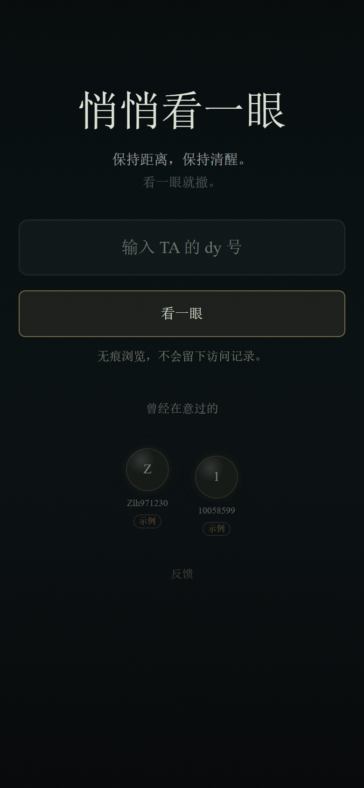
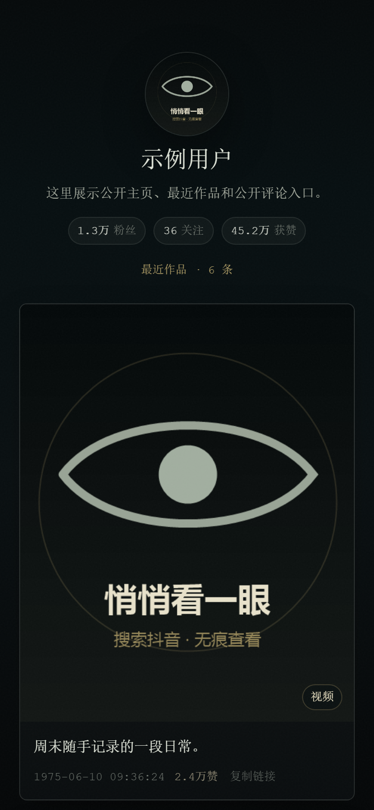

# 悄悄看一眼 Open

输入抖音 dy 号，查看公开主页信息、最近作品、视频/图文内容和首批公开评论。

## 免责声明

本项目仅用于学习、研究和技术交流，请勿用于侵犯他人隐私、违反平台规则或任何非法用途。使用者应自行承担使用本项目产生的风险与责任。

## 产品截图

<p>
  
  
</p>

## 使用方法

环境要求：

- Node.js 18+
- Google Chrome / Chromium。本地运行时由 Playwright 使用；Docker 镜像已内置浏览器。

安装依赖：

```bash
npm install
```

如果本机没有 Playwright 浏览器：

```bash
npx playwright install chromium
```

本地运行：

```bash
npm run serve
```

浏览器打开：

```text
http://localhost:3000/
```

关闭后台服务：

```bash
npm stop
```

如需本地后台运行：

```bash
npm run start:local
```

Docker 运行：

```bash
docker build -t fangxiaba-open .
docker run -d --name fangxiaba-open --env-file .env -p 3000:3000 fangxiaba-open
```

如需调整端口、跨域、代理、并发等配置，可复制 `.env.example` 为 `.env` 后按需修改。
